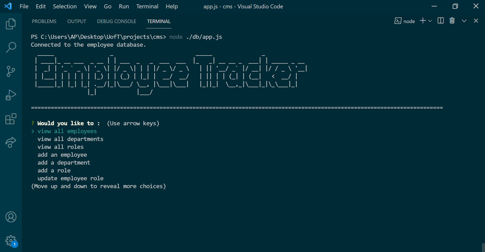
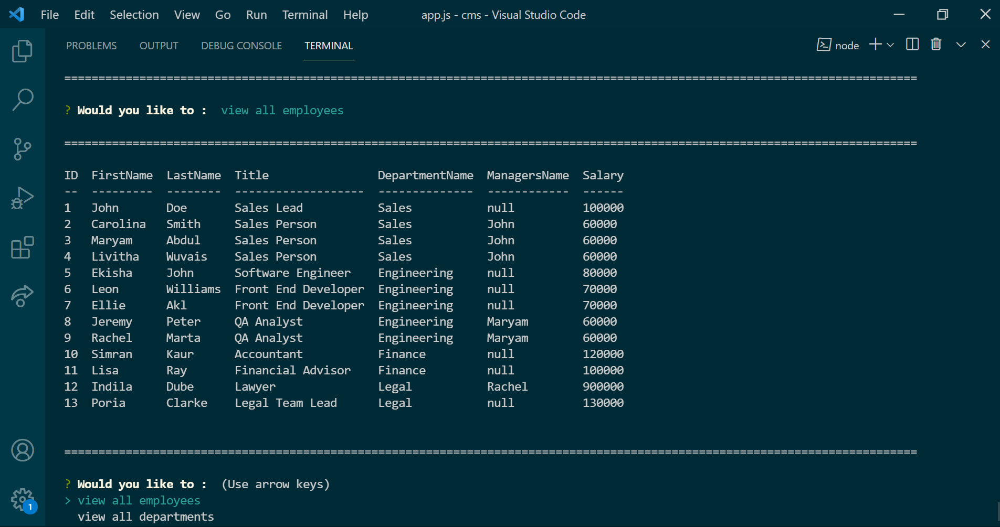
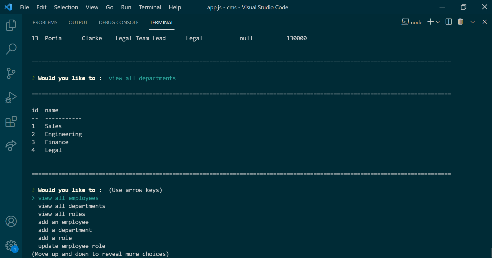

# Employee Tracker

## Employee Tracker Repository

click the link below to check the repository : [Github Repository Link](https://github.com/kirti18patel/cms)

  [](https://opensource.org/licenses/MIT)

  MIT Link is : [https://opensource.org/licenses/MIT](https://opensource.org/licenses/MIT)

  ## Description 

  > A node.js application that uses user input from inquirer to populate an employee tracker database displaying members of a company.
  
### Tech Used
    -Node.js
    -MySql
    -Inquirer

## Table of Contents
  * [License](#license)
  * [Installation](#installation)
  * [Preview](#preview) 
  * [Usage](#usage)

## License 

  > MIT

## Installation
  Install the dependencies and devDependencies.
  
  ```sh
  npm init
  ```
   ```sh
  npm install inquirer
  ```   
   ```sh
  npm install mysql2
  ```
   ```sh
  npm install console-table
  ```
   ```sh
  npm install figlet
  ```
## Preview
    Preview of employee tracker -




Walkthrough video of Employee tracker -


## Usage 
  User have to install all the dependencies before running it on terminal.

```sh
node ./db/app.js
```

#### Contact - **kirti18patel@yahoo.com**

MIT © [https://github.com/kirti18patel](https://github.com/kirti18patel)